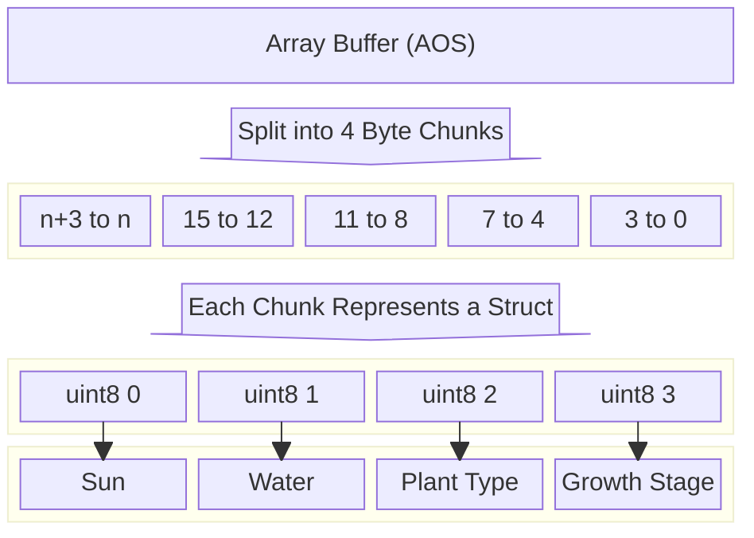

## Introducing the Team

Since I am working individually (after receiving permission from the professor over Discord), I will fulfill all the roles required for the project:

- **Tools Lead**: I am responsible for choosing and setting up tools like the IDE, art/sound editors, source control (GitHub), and deployment platforms, as well as maintaining consistent coding and formatting standards.
- **Engine Lead**: I will select the primary engine, ensure its proper configuration, and organize the project structure to streamline engine usage. I will also handle software design patterns to shield other parts of the game from engine-specific details.
- **Design Lead**: I will define the creative direction, including the look, feel, and gameplay mechanics of the project. I am also responsible for creating necessary game assets such as art, sound, and any code that defines the game’s thematic and visual tone.

## Tools and Materials

### Engines, Libraries, Frameworks, and Platforms
The primary platform is **JavaScript + HTML5** using the **Phaser framework**. Phaser is an excellent choice for this project since it supports 2D grid-based mechanics and offers tools like state handling, event systems, and sprite management. It aligns with the tools and concepts learned in this course (e.g., D2), making development faster and more efficient. Using **Live Server**, the game is run locally in the browser, allowing for rapid development and testing.

### Programming Languages and Data Formats
The game will use **JavaScript** as the primary programming language. JavaScript is well-suited for web development and integrates seamlessly with Phaser. For data storage, **JSON** will be used to serialize and deserialize the game state, as it's lightweight and ideal for managing the grid state. This pairing ensures quick prototyping and compatibility with browser-based development.

### Tools for Authoring
The project will use **Visual Studio Code (VS Code)** as the IDE due to its support for JavaScript and Live Server extensions. For visual assets like 2D sprites, tools such as **Aseprite** or **GIMP** will be used to create pixel art characters, tiles, and plants. Sound effects will be generated using **Bfxr**, which is simple and effective for producing game-appropriate audio. These tools are lightweight, beginner-friendly, and suited for solo development.

### Alternate Platform
The alternate platform will use **JavaScript + Three.js** instead of Phaser. Three.js allows for rendering the gameplay in 3D while maintaining the same game mechanics. This provides a visually distinct experience with colored cubes and minimalist aesthetics, making it a creative departure from the 2D style. Three.js offers an opportunity to explore new techniques and experiment with depth while keeping the core logic consistent.

## Outlook

Working individually on this project, I aim to develop a concise but polished grid-based farming simulation that demonstrates creativity and mastery of game programming patterns. Without a team, my approach prioritizes simplicity in visuals and mechanics while focusing on delivering a seamless, fully functional experience with robust features like save/load systems and undo/redo functionality—elements that larger teams might find logistically challenging.

The riskiest part of the project will likely be implementing complex state management within a single byte array (as required by F1.a) while ensuring features like undo/redo and save/load systems remain bug-free. Balancing this technical challenge with the need for clear gameplay feedback and a satisfying user experience will require disciplined planning and testing.

By approaching the project with **JavaScript**, **Phaser**, and lightweight authoring tools, I hope to strengthen my ability to manage the entire development pipeline, from writing efficient, modular code to integrating art and audio assets. I also look forward to deepening my understanding of game programming patterns (e.g., ECS, State Pattern) and exploring how to optimize memory and state in grid-based simulations.

## Devlog Entry for F0

### How We Satisfied the Software Requirements

- **[F0.a] Control a character moving over a 2D grid**: The player controls a character that moves across the 5x5 grid using arrow keys. Movement is restricted to valid grid cells, ensuring the character cannot leave the grid.

- **[F0.b] Advance time manually in the turn-based simulation**: Time advances when the player presses the "Space" key. This triggers random regeneration of sun and water levels for each grid cell and updates the growth stage of all plants.

- **[F0.c] Reap or sow plants on grid cells only when near them**: The player can sow a plant by clicking a button for the desired plant type when adjacent to a grid cell. Reaping is possible only for fully grown plants located in the same cell as the player.

- **[F0.d] Random sun and water levels for each grid cell**: Each grid cell generates a random amount of sunlight and accumulates water each turn. Sunlight resets every turn, while water gradually accumulates up to a maximum level.

- **[F0.e] Each plant has a distinct type and growth level**: The game includes three plant types—cabbage, carrot, and corn—each with unique costs, growth requirements, and produce values. Plants progress through three growth stages, represented by different sprites.

- **[F0.f] Spatial rules govern plant growth**: Plants require specific amounts of sun and water to grow. Each turn, the game checks the sun and water levels for each plant and advances their growth stages if requirements are met.

- **[F0.g] Play scenario with a completion condition**: The win condition requires collecting 50g of produce. Players must strategically plant, reap, and manage resources to achieve the goal.

## Devlog Entry for F1

### How We Satisfied the Software Requirements

- **[F1.a] Grid state stored in a single byte array**:
    - Each cell is represented using 4 bytes: `sun`, `water`, `plantType`, and `growthStage`.
    - Array-of-Structures (AoS) format is used for efficient data handling.
    - [F1.a data structure diagram]

    
- **[F1.b] Save and load game state**: A JSON-based save/load system supports manual saves, auto-saves, and loading saved states.

- **[F1.c] Undo/redo functionality**: Added a history stack that stores game states, and actions are reversible with UI updates.

- **[F1.d] Improved player feedback**: Added visual cues, hover effects, and a message log for clear communication of actions and goals.

- **[F1.e] Clear narration of player actions**: Action logs narrate each step taken by the player.

- **[F1.f] Indirect effect feedback**: Animations and effects visually highlight changes like plant growth and grid updates.

- **[F1.g] Use of audio feedback**: Placeholder audio cues were added to emphasize key actions and events.

---

### Reflection

- **Undo/Redo Enhancements**: We refined state management to ensure UI consistency during undo/redo actions.
- **Save/Load System Debugging**: Addressed issues where auto-saves interfered with starting a new game.
- **Visual Scaling**: Resolved issues with plant rendering by unifying grid and sprite scaling.

These adjustments highlight the evolution of our game design and the importance of user feedback.
