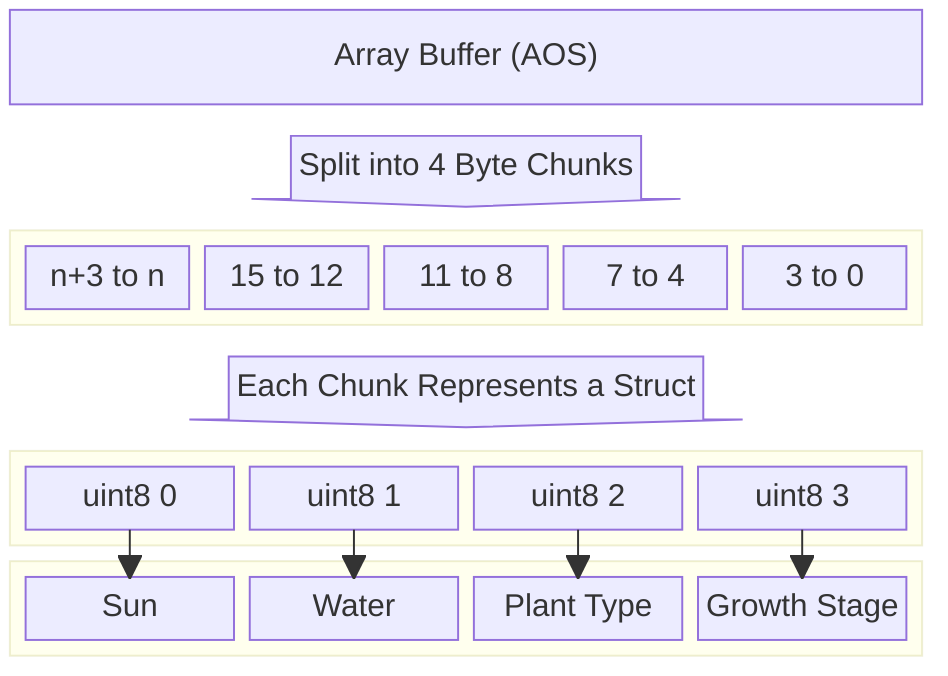

## Introducing the Team

Since I am working individually (after receiving permission from the professor over Discord), I will fulfill all the roles required for the project:

- **Tools Lead**: I am responsible for choosing and setting up tools like the IDE, art/sound editors, source control (GitHub), and deployment platforms, as well as maintaining consistent coding and formatting standards.
- **Engine Lead**: I will select the primary engine, ensure its proper configuration, and organize the project structure to streamline engine usage. I will also handle software design patterns to shield other parts of the game from engine-specific details.
- **Design Lead**: I will define the creative direction, including the look, feel, and gameplay mechanics of the project. I am also responsible for creating necessary game assets such as art, sound, and any code that defines the game’s thematic and visual tone.

## Tools and Materials

### Engines, Libraries, Frameworks, and Platforms
The primary platform is **JavaScript + HTML5** using the **Phaser framework**. Phaser is an excellent choice for this project since it supports 2D grid-based mechanics and offers tools like state handling, event systems, and sprite management. It aligns with the tools and concepts learned in this course (e.g., D2), making development faster and more efficient. Using **Live Server**, the game is run locally in the browser, allowing for rapid development and testing.

### Programming Languages and Data Formats
The game will use **JavaScript** as the primary programming language. JavaScript is well-suited for web development and integrates seamlessly with Phaser. For data storage, **JSON** will be used to serialize and deserialize the game state, as it's lightweight and ideal for managing the grid state. This pairing ensures quick prototyping and compatibility with browser-based development.

### Tools for Authoring
The project will use **Visual Studio Code (VS Code)** as the IDE due to its support for JavaScript and Live Server extensions. For visual assets like 2D sprites, tools such as **Aseprite** or **GIMP** will be used to create pixel art characters, tiles, and plants. Sound effects will be generated using **Bfxr**, which is simple and effective for producing game-appropriate audio. These tools are lightweight, beginner-friendly, and suited for solo development.

### Alternate Platform
The alternate platform will use **JavaScript + Three.js** instead of Phaser. Three.js allows for rendering the gameplay in 3D while maintaining the same game mechanics. This provides a visually distinct experience with colored cubes and minimalist aesthetics, making it a creative departure from the 2D style. Three.js offers an opportunity to explore new techniques and experiment with depth while keeping the core logic consistent.

## Outlook

Working individually on this project, I aim to develop a concise but polished grid-based farming simulation that demonstrates creativity and mastery of game programming patterns. Without a team, my approach prioritizes simplicity in visuals and mechanics while focusing on delivering a seamless, fully functional experience with robust features like save/load systems and undo/redo functionality—elements that larger teams might find logistically challenging.

The riskiest part of the project will likely be implementing complex state management within a single byte array (as required by F1.a) while ensuring features like undo/redo and save/load systems remain bug-free. Balancing this technical challenge with the need for clear gameplay feedback and a satisfying user experience will require disciplined planning and testing.

By approaching the project with **JavaScript**, **Phaser**, and lightweight authoring tools, I hope to strengthen my ability to manage the entire development pipeline, from writing efficient, modular code to integrating art and audio assets. I also look forward to deepening my understanding of game programming patterns (e.g., ECS, State Pattern) and exploring how to optimize memory and state in grid-based simulations.

## Devlog Entry for F0

### How We Satisfied the Software Requirements

- **[F0.a] Control a character moving over a 2D grid**: The player controls a character that moves across the 5x5 grid using arrow keys. Movement is restricted to valid grid cells, ensuring the character cannot leave the grid.

- **[F0.b] Advance time manually in the turn-based simulation**: Time advances when the player presses the "Space" key. This triggers random regeneration of sun and water levels for each grid cell and updates the growth stage of all plants.

- **[F0.c] Reap or sow plants on grid cells only when near them**: The player can sow a plant by clicking a button for the desired plant type when adjacent to a grid cell. Reaping is possible only for fully grown plants located in the same cell as the player.

- **[F0.d] Random sun and water levels for each grid cell**: Each grid cell generates a random amount of sunlight and accumulates water each turn. Sunlight resets every turn, while water gradually accumulates up to a maximum level.

- **[F0.e] Each plant has a distinct type and growth level**: The game includes three plant types—cabbage, carrot, and corn—each with unique costs, growth requirements, and produce values. Plants progress through three growth stages, represented by different sprites.

- **[F0.f] Spatial rules govern plant growth**: Plants require specific amounts of sun and water to grow. Each turn, the game checks the sun and water levels for each plant and advances their growth stages if requirements are met.

- **[F0.g] Play scenario with a completion condition**: The win condition requires collecting 50g of produce. Players must strategically plant, reap, and manage resources to achieve the goal.

## Devlog Entry for F1

### How We Satisfied the Software Requirements

- **[F1.a] Grid state stored in a single byte array**:
    - Each cell is represented using 4 bytes: `sun`, `water`, `plantType`, and `growthStage`.
    - Array-of-Structures (AoS) format is used for efficient data handling.
    - [F1.a data structure diagram]


    
- **[F1.b] Save and load game state**: A JSON-based save/load system supports manual saves, auto-saves, and loading saved states.

- **[F1.c] Undo/redo functionality**: Added a history stack that stores game states, and actions are reversible with UI updates.

- **[F1.d] Improved player feedback**: Added visual cues, hover effects, and a message log for clear communication of actions and goals.

- **[F1.e] Clear narration of player actions**: Action logs narrate each step taken by the player.

- **[F1.f] Indirect effect feedback**: Animations and effects visually highlight changes like plant growth and grid updates.

- **[F1.g] Use of audio feedback**: Placeholder audio cues were added to emphasize key actions and events.

---

### Reflection

- **Undo/Redo Enhancements**: We refined state management to ensure UI consistency during undo/redo actions.
- **Save/Load System Debugging**: Addressed issues where auto-saves interfered with starting a new game.
- **Visual Scaling**: Resolved issues with plant rendering by unifying grid and sprite scaling.

These adjustments highlight the evolution of our game design and the importance of user feedback.


## Devlog Entry for F2

### How We Satisfied the Software Requirements

#### F0+F1

The previous F0 and F1 requirements remain satisfied in the latest version of our software. Minor refinements were made to improve code quality and user experience:
- The plant rendering system was revised to fix layering issues and ensure plants appeared properly above the grid.
- Refactored `PlantManager` and integrated the `PlantDefinitionLanguage` for cleaner and more maintainable code.

#### External DSL for Scenario Design

We implemented an external DSL for defining gameplay scenarios. Our DSL is based on YAML, which is a well-known data language for configuration. This design allows scenario designers to define starting conditions, randomization policies, unique events, and victory conditions without modifying the game's core logic.

Example scenario in YAML:

```yaml
tutorial:
  grid_size: [5, 5]
  available_plants: ["cabbage"]
  win_conditions:
    - ["cabbage", "min", 3]
  special_events: []
  human_instructions: "Plant and grow at least 3 cabbages to win."
```

Explanation:
	•	grid_size: Defines the size of the game grid (5x5).
	•	available_plants: Specifies the plants available to the player in this scenario (weed only in this case).
	•	win_conditions: Describes the victory condition. Here, the player must grow at least 5 weeds to win.
	•	special_events: Schedules unique events (none in this scenario).
	•	human_instructions: Provides instructions to the player in natural language.

By storing scenarios in a JSON format, designers can easily edit them without touching the game code. The scenarios are loaded at runtime and parsed into usable data structures.

Internal DSL for Plants and Growth Conditions

The internal DSL for defining plant types and growth conditions was implemented using JavaScript. It allows for expressive, readable definitions of plant types and their unique growth rules. Here’s an example:

```yaml
PlantDefinitions.definePlant(($) => {
    $.name("corn")
        .costToPlant(7)
        .produce(15)
        .growsWhen(({ sun, water, neighbors }) => {
            const cornNeighbors = neighbors.filter((n) => n.type === "corn").length;
            return sun >= 3 && water >= 2 && cornNeighbors >= 1;
        });
});
```


Explanation:
	•	name: Sets the plant type name (corn in this case).
	•	costToPlant: Specifies the cost to plant it (7 currency).
	•	produce: Determines the produce value upon reaping (15).
	•	growsWhen: Defines the conditions under which the plant grows. In this case, corn requires at least 3 units of sun, 2 units of water, and at least 1 neighboring corn plant to grow.

The DSL leverages JavaScript’s expressive capabilities to define arbitrary growth rules using native language constructs (e.g., closures). This makes it easier to add structurally different plant types, such as plants that grow based on moisture levels or neighboring species.

Switch to Alternate Platform

Due to time constraints, I was unable to port the project to an alternate platform as planned. My original goal was to explore Three.js as the alternate platform, rendering the game in 3D while keeping the core logic intact. However, the complexity of implementing F2’s external and internal DSLs required more development time than anticipated. As a result, this requirement remains unmet.

If I were to revisit this, I would port the grid-based gameplay and plant growth logic to Three.js using simple 3D cubes for the grid and models for plants. Most of the game logic (e.g., grid management, plant growth) could be reused with minimal changes, but the rendering and input systems would need to be restructured for a 3D environment.

Reflection

F2 introduced new challenges that required me to rethink how the game’s logic was structured:
	1.	Scenario Management: Implementing the external DSL showed me the value of separating data-driven design from the main game logic. This separation made it easier to add new scenarios dynamically.
	2.	Extensibility Through DSLs: Creating an internal DSL for plants highlighted the power of encapsulating domain-specific logic in reusable constructs. It also demonstrated the importance of expressive APIs for future-proofing game features.
	3.	Time Constraints: Despite planning to explore an alternate platform, I realized the need to prioritize F2’s core requirements over additional experimentation. This reinforced the importance of scope management in solo projects.

Moving forward, I aim to refine the game further by improving feedback mechanisms and addressing any remaining bugs. The next milestone will focus on enhancing player feedback through improved UI/UX and possibly revisiting the alternate platform implementation.

Note: Please find the F2 video here: https://drive.google.com/drive/folders/1qzUa_PQLYlBxoCLmyRKfQweWgxesjTtK?usp=sharing

## Devlog Entry for F3

### How We Satisfied the Software Requirements

#### F0+F1+F2

The previous F0, F1, and F2 requirements remain satisfied in the latest version of the software. Minor adjustments were made to integrate internationalization and localization without impacting existing functionality. Additionally, the undo/redo functionality was refined to ensure the UI updates correctly after state changes.

#### Internationalization

To support internationalization, all user-facing strings were decoupled from the core logic and moved into a centralized language object. The `t` function dynamically retrieves localized text for any key. This design ensures all text visible to the player is easily replaceable, making it simple to add new languages or modify existing translations.

Adding a new translatable string requires:
1. Adding the new string to the `languages` object in `BootScene.js` for all supported languages.
2. Updating any `t('key')` references in the code to use the new key.

This approach eliminates hard-coded text and enforces consistency across the game.

#### Localization

The game now supports three languages: English (`en`), Simplified Chinese (`zh`), and Arabic (`ar`). Here's how localization was achieved:

- **English (Default)**: The English localization served as the base language and was written directly into the language object.
- **Simplified Chinese**: Translations were generated using a combination of personal knowledge and assistance from language tools like ChatGPT.
- **Arabic**: ChatGPT assisted in providing Arabic translations. Challenges like right-to-left (RTL) text alignment were resolved using Phaser's `setRTL()` feature.

Players can select their preferred language from a dropdown menu in the main menu. This setting dynamically updates the game’s text without restarting. By default, the game starts in English, but the selected language persists between sessions.

#### Mobile Installation

The game was made installable on smartphones as a Progressive Web App (PWA). Following [this tutorial](https://developer.mozilla.org/en-US/docs/Web/Progressive_web_apps/Tutorials/js13kGames/Installable_PWAs), the following steps were completed:

1. **Web Manifest**: A `game.webmanifest` file was created, specifying metadata such as app name, description, start URL, and an app icon. The app icon was sourced from a public URL and added to the manifest.
2. **Service Worker**: A service worker was implemented to cache game assets, enabling offline play. This ensured the game remained functional without an internet connection after the initial installation.

Once configured, the game was tested and successfully installed on an Android device using Chrome. The PWA could be launched from the home screen and provided a seamless full-screen experience.

#### Mobile Play (Offline)

To ensure smooth gameplay on mobile devices, the following changes were made:
- **Scaling**: Adjusted UI elements and text to accommodate smaller screen sizes.
- **Offline Support**: Added a service worker to cache assets, ensuring all necessary files were available for offline play. Testing confirmed that the game worked without any issues in airplane mode.

No significant changes were needed for game logic, as Phaser's responsive design and lightweight assets translated well to mobile platforms.

### Reflection

F3 highlighted the importance of designing for accessibility and usability:
1. **Internationalization**: This requirement emphasized the value of separating presentation from logic. It also reinforced the importance of planning for scalability—adding a fourth language would now require minimal effort.
2. **Mobile Play**: Creating a PWA showcased the benefits of web-based game development. By leveraging existing browser features, the game became accessible on a wider range of devices with minimal additional development.
3. **Scope Management**: Completing F3 within the given timeframe required careful prioritization. For example, instead of building a new language selection UI from scratch, I opted for a functional dropdown menu that integrated seamlessly with existing code.

This milestone reinforced my confidence in adapting games for different platforms and audiences. Moving forward, I aim to refine the game's accessibility features and explore additional platform support.


Note: Please find the F3 video here: https://drive.google.com/drive/folders/1qzUa_PQLYlBxoCLmyRKfQweWgxesjTtK?usp=sharing

